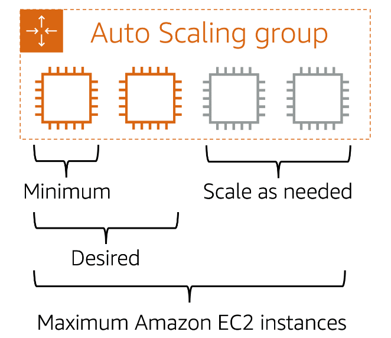
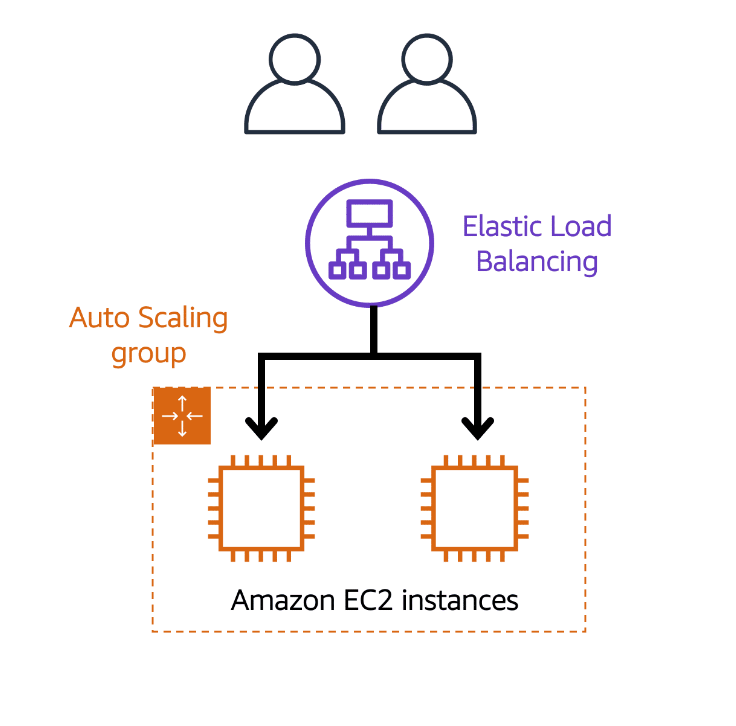
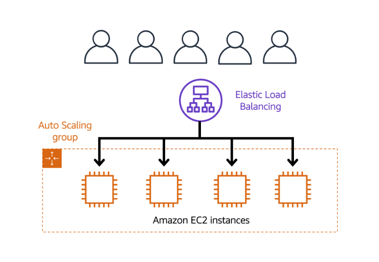
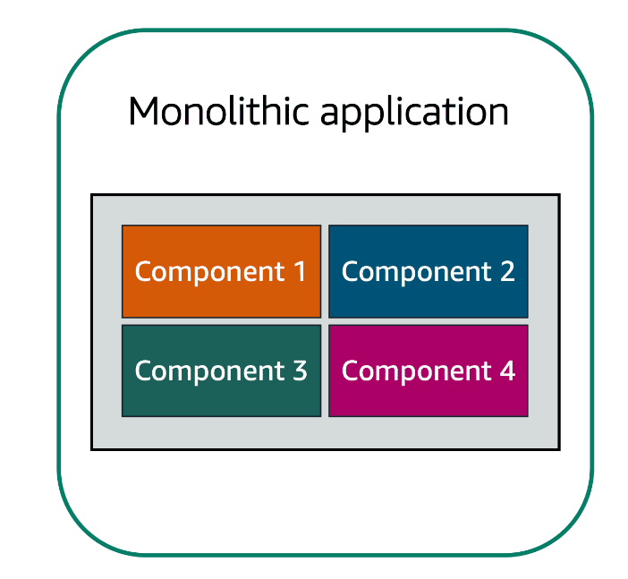
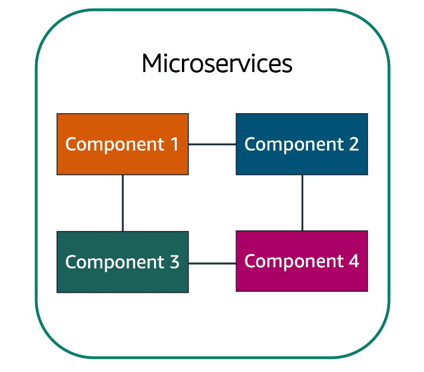
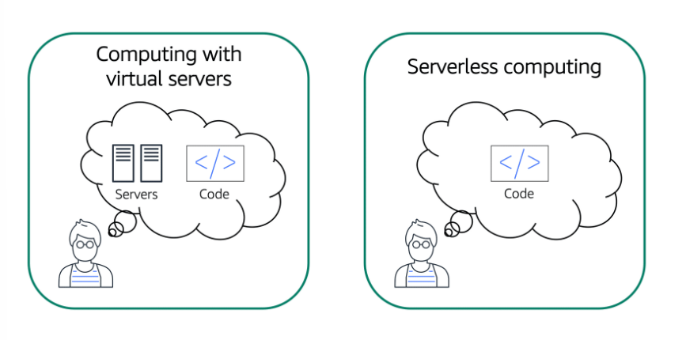
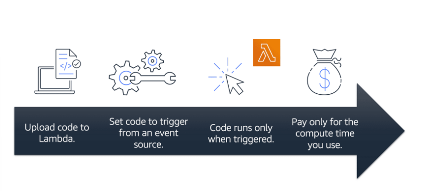

# Compute at AWS Cloud

# [Amazon EC2](#amazon-ec2)

**[Amazon Elastic Compute Cloud (Amazon EC2)](https://aws.amazon.com/ec2/)** provides secure, resizable compute capacity in the cloud as Amazon EC2 instances. 

When you spin up an EC2 instance, you aren't necessarily taking an entire host to yourself. Instead, you are sharing the host with multiple other instances, otherwise known as **virtual machines**. And a hypervisor running on the host machine is responsible for sharing the underlying physical resources between the virtual machines. This idea of sharing underlying hardware is called **multitenancy**.

EC2 instances are resizable. You might start with a small instance, but at some point you can give that instance more memory and more CPU. This is what we call **vertically scaling** an instance. 

---

## [How Amazon EC2 works](#how-amazon-ec2-works)

1. Launch an instance - select a template with basic configuration, instance type, security and network settings.
2. Connect to the instance (e.g. ssh)
3. Use instance - install software, add storage...

Some **benefits** of using Amazon EC2 include:

* You can provision and launch an Amazon EC2 instance within minutes.
* You can stop using it when you have finished running a workload.
* You pay only for the compute time you use when an instance is running, not when it is stopped or terminated.
* You can save costs by paying only for server capacity that you need or want.

---

## [Amazon EC2 instance types](#amazon-ec2-instance-types)

1. **General purpose instances provide a balance of compute, memory, and networking resources.** 

If you have an application in which the resource needs for compute, memory, and networking are roughly equivalent, you might consider running it on a general purpose instance because the application does not require optimization in any single resource area.

2. **Compute optimized instances are ideal for compute-bound applications that benefit from high-performance processors.** 

Ideal for compute-intensive tasks like gaming servers, high performance computing or HPC, and even scientific modeling.

3. **Memory optimized instances are designed to deliver fast performance for workloads that process large datasets in memory.**

4. **Accelerated computing instances use hardware accelerators, or coprocessors, to perform some functions more efficiently than is possible in software running on CPUs.**

Examples of these functions include floating-point number calculations, graphics processing, and data pattern matching. Accelerated computing instances are ideal for workloads such as graphics applications, game streaming, and application streaming.

5. **Storage optimized instances are designed for workloads that require high, sequential read and write access to large datasets on local storage.** 

---

## [Amazon EC2 Pricing](#amazon-ec2-pricing)

1. **On-Demand Instances are ideal for short-term, irregular workloads that cannot be interrupted.**

*Use cases:* developing and testing applications and running applications that have unpredictable usage patterns. Not recommended for workloads that last a year or longer.

2. **Amazon EC2 Savings Plans enable you to reduce your compute costs by committing to a consistent amount of compute usage for a 1-year or 3-year term.**

This term commitment results in savings of up to **72%** over On-Demand costs.

3. **Reserved Instances are a billing discount applied to the use of On-Demand Instances in your account.**

You can purchase **Standard Reserved** and **Convertible Reserved** Instances for a 1-year or 3-year term, and **Scheduled Reserved** Instances for a 1-year term. 

4. **Spot Instances are ideal for workloads with flexible start and end times, or that can withstand interruptions.**

Spot Instances use unused Amazon EC2 computing capacity and offer you cost savings at up to **90% off** of On-Demand prices.

5. **Dedicated Hosts are physical servers with Amazon EC2 instance capacity that is fully dedicated to your use.** 

You can use your existing *per-socket, per-core, or per-VM* software licenses to help maintain license compliance. 

You can purchase **On-Demand Dedicated Hosts** and **Dedicated Hosts Reservations.** 

---

## [Amazon EC2 Scaling](#amazon-ec2-scaling)

### [Scalability](#scalability)

**Scalability involves beginning with only the resources you need and designing your architecture to automatically respond to changing demand by scaling out or in.** 

If you want the scaling process to happen automatically, the AWS service that provides this functionality for Amazon EC2 instances is **Amazon EC2 Auto Scaling.**

---

### [Amazon EC2 Auto Scaling](#amazon-ec2-auto-scaling)

**[Amazon EC2 Auto Scaling](https://aws.amazon.com/ec2/autoscaling/) enables you to automatically add or remove Amazon EC2 instances in response to changing application demand.**
It also ensures high availability. 

**Scaling out (horizontal scaling)** is when you add more instances to your Auto Scaling Group and **scaling in** is when you reduce the number of instances in your Auto Scaling Group.

Within Amazon EC2 Auto Scaling, you can use two approaches: *dynamic scaling* and *predictive scaling*.

* **Dynamic scaling responds to changing demand.**

* **Predictive scaling automatically schedules the right number of Amazon EC2 instances based on predicted demand.**

### [Amazon EC2 Auto Scaling Example](#amazon-ec2-auto-scaling-example)

When you create an Auto Scaling group, you can set the minimum number of Amazon EC2 instances. 

* The **minimum capacity** is the number of Amazon EC2 instances that launch immediately after you have created the Auto Scaling group.
* You can set the **desired capacity** at two Amazon EC2 instances even though your application needs a minimum of a single Amazon EC2 instance to run.
* You can set the **maximum capacity**. For example, you might configure the Auto Scaling group to scale out in response to increased demand, but only to a maximum of four Amazon EC2 instances.

---

## [Elastic Load Balancing](#elastic-load-balancing)

A load balancer is an application that takes in requests and routes them to the instances to be processed.

**[Elastic Load Balancing](https://aws.amazon.com/elasticloadbalancing/) is the AWS service that automatically distributes incoming application traffic across multiple resources.**

Elastic Load Balancing runs at the *Region level* rather than on individual EC2 instances.

* *ELB Low-demand Example*

* *ELB High-demand Example*

---

## [Monolithic Apps vs Microservices](#monolithic-apps-vs-microservices)

If you have an app with *tightly coupled* components, this type of architecture can be considered a **monolithic application**.

In this approach to application architecture, **if a single component fails, other components fail, and possibly the entire application fails.**

In a **microservices** approach, application components are loosely coupled. 

In this case, **if a single component fails, the other components continue to work because they are communicating with each other.**

Two services facilitate application integration: 
* **Amazon Simple Notification Service (Amazon SNS)**
* **Amazon Simple Queue Service (Amazon SQS).**

---

## [Amazon SNS](#amazon-sns)

**[Amazon Simple Notification Service (Amazon SNS)](https://aws.amazon.com/sns/) is a publish/subscribe service.**

Using Amazon SNS topics, a publisher publishes messages to subscribers.Subscribers can be web servers, email addresses, AWS Lambda functions...

It is possible for subscribers to subscribe to a single topic or to multiple topics.

---

## [Amazon SQS](#amazon-sqs)

**[Amazon Simple Queue Service (Amazon SQS)](https://aws.amazon.com/sqs/) is a message queuing service.** 

Using Amazon SQS, you can send, store, and receive messages between software components, without losing messages or requiring other services to be available. 

In Amazon SQS, an application sends messages into a queue. A user or service retrieves a message from the queue, processes it, and then deletes it from the queue.

---

## [Additional Compute Services](#additional-compute-services)

### [Serverless Computing](#serverless-computing)

**The term “serverless” means that your code runs on servers, but you do not need to provision or manage these servers.**

**Serverless** means that you cannot actually see or access the underlying infrastructure or instances that are hosting your application.

Another benefit of serverless computing is the flexibility to scale serverless applications automatically.

---

### [AWS Lambda](#aws-lambda)

**[AWS Lambda](https://aws.amazon.com/lambda) is a service that lets you run code without needing to provision or manage servers.** 

AWS Lambda is a service that allows you to upload your code into what's called a Lambda function. Configure a trigger and from there, the service waits for the trigger. When the trigger is detected, the code is automatically run in a managed environment.

---

### [Containers](#containers)

**Containers provide you with a standard way to package your application's code and dependencies into a single object.**

**Container orchestration** services help you to deploy, manage, and scale your containerized applications. 

---

### [Amazon ECS](#amazon-ecs)

**[Amazon Elastic Container Service (Amazon ECS)](https://aws.amazon.com/ecs/) is a highly scalable, high-performance container management system that enables you to run and scale containerized applications on AWS.**

Amazon ECS supports **[Docker](https://www.docker.com/)** containers.

AWS supports the use of *open-source* **Docker Community Edition** and *subscription-based* **Docker Enterprise Edition.**

---

### [Amazon EKS](#amazon-eks)

**[Amazon Elastic Kubernetes Service (Amazon EKS)](https://aws.amazon.com/eks/) is a fully managed service that you can use to run Kubernetes on AWS.** 

**[Kubernetes](https://kubernetes.io/)** is open-source software that enables you to deploy and manage containerized applications at scale. 

---

### [AWS Fargate](#aws-fargate)

**[AWS Fargate](https://aws.amazon.com/fargate/) is a serverless compute engine for containers. It works with both Amazon ECS and Amazon EKS.** 

When using AWS Fargate, you do not need to provision or manage servers. 

---

### [Compute Options](#compute-options)
- If you are trying to host traditional applications and want full access to the underlying operating system like Linux or Windows, you are going to want to use **EC2**.
- If you are looking to host short running functions, service-oriented or event driven applications and you don't want to manage the underlying environment at all, look into the serverless **AWS Lambda**.
-  If you are looking to run Docker container-based workloads on AWS, you first need to choose your *orchestration* tool. Do you want to use **Amazon ECS or Amazon EKS**? 
- After you choose your tool, you then need to chose your platform. Do you want to run your containers on **EC2** instances that you manage or in a serverless environment like **AWS Fargate** that is managed for you? 

---

### [Notes](#notes)
- In computing, the term *input/output operations per second (IOPS)* is a metric that measures the performance of a storage device. *Storage optimized* instances are designed to deliver tens of thousands of low-latency, random IOPS to applications. 
- **AWS Cost Explorer is a tool that enables you to visualize, understand, and manage your AWS costs and usage over time.**
-  If you are considering your options for Savings Plans, AWS Cost Explorer can analyze your Amazon EC2 usage over the past 7, 30, or 60 days. 
- Of all the Amazon EC2 Pricing options that were covered, **Dedicated Hosts are the most expensive.**
- To scale faster, you can use dynamic scaling and predictive scaling together.
- If you do not specify the desired number of Amazon EC2 instances in an Auto Scaling group, the desired capacity defaults to your minimum capacity.
- When you use Docker containers on AWS, you need processes to start, stop, restart, and monitor containers running across not just one EC2 instance, but a number of them together which is called a cluster. The process of doing these tasks is called **container orchestration**.
- **AWS Fargate** is a serverless compute platform for ECS or EKS.

---

# References

* [Compute on AWS](https://aws.amazon.com/products/compute)
* [AWS Compute Blog](https://aws.amazon.com/blogs/compute/)
* [AWS Compute Services](https://docs.aws.amazon.com/whitepapers/latest/aws-overview/compute-services.html) *Whitepaper*
* [Hands-On Tutorials:Compute](https://aws.amazon.com/getting-started/hands-on/?awsf.getting-started-category=category%23compute&awsf.getting-started-content-type=content-type%23hands-on)
* [Deep Dive: Serverless](https://aws.amazon.com/getting-started/deep-dive-serverless/)
* [AWS Case Studies: Serverless](https://aws.amazon.com/solutions/case-studies/?customer-references-cards.sort-by=item.additionalFields.publishedDate&customer-references-cards.sort-order=desc&awsf.customer-references-location=*all&awsf.customer-references-segment=*all&awsf.customer-references-product=product%23vpc%7Cproduct%23api-gateway%7Cproduct%23cloudfront%7Cproduct%23route53%7Cproduct%23directconnect%7Cproduct%23elb&awsf.customer-references-category=category%23serverless)