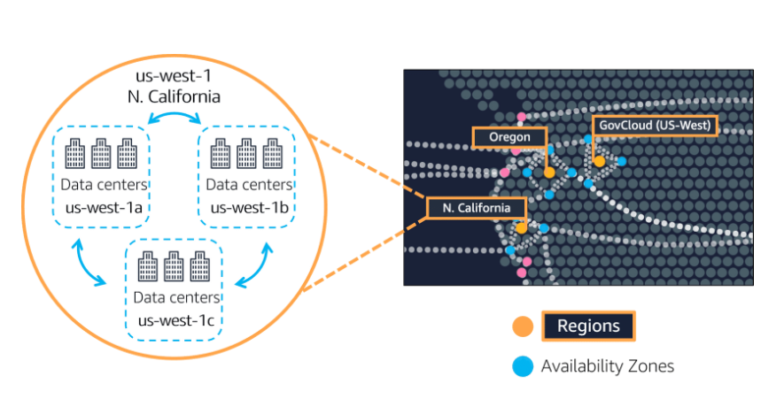
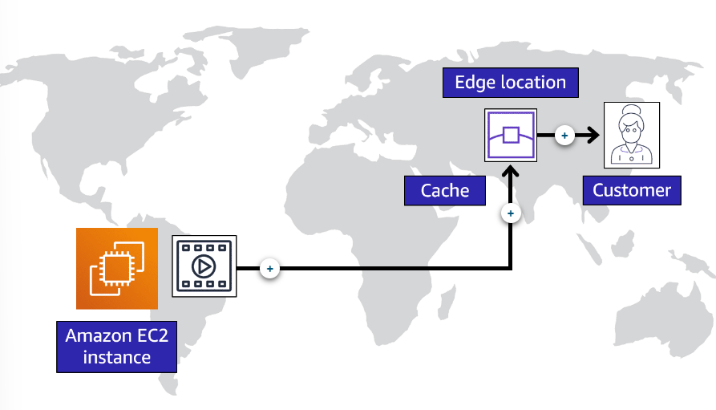

# Global Infrastructure and Reliability

## [Regions](#regions)

**A Region is a geographical area that contains AWS resources.**

Each **AWS Region** consists of multiple isolated and physically separate Availability Zones within a geographic Region.

Inside each Region, there are multiple data centers that have all the compute, storage, and other services you need to run your applications. 
 
Each Region can be connected to each other Region through a high speed fiber network.

**Regional data sovereignty** is part of the critical design of AWS Regions. Each Region is isolated from every other Region in the sense that absolutely no data goes in or out of your environment in that Region without you explicitly granting permission for that data to be moved.

### [Selecting a Region](#selecting-a-region)

Factors to be considered:
- **Compliance** with data governance and legal requirements.

*For example,* if your company requires all of its data to reside within the boundaries of the UK, you would choose the London Region. 

- Proximity to your customers.

*For example,* your company is based in Washington, DC, and many of your customers live in Singapore. You might consider running your infrastructure in the Northern Virginia Region to be close to company headquarters, and run your applications from the Singapore Region.

- Available services within a Region.

*For example,* Amazon Braket is not yet available in every AWS Region around the world, so developers would have to run it in one of the Regions that already offers it.

- Pricing.

*For example,* the way Brazil’s tax structure is set up, it might cost 50% more to run the same workload out of the São Paulo Region compared to the Oregon Region.

---

## [Availability Zones](#availability-zones)

**An Availability Zone is a single data center or a group of data centers within a Region.**

Each Availability Zone is one or more discrete data centers with redundant power, networking, and connectivity. 

Availability Zones are located tens of miles apart from each other. This is close enough to have low latency between Availability Zones. and if a disaster occurs in one part of the Region, they are distant enough to reduce the chance that multiple Availability Zones are affected.

If us-west-1a AZ were to fail, your application would still be running in us-west-1b.

---

## [Edge Locations](#edge-locations)

**An edge location is a site that *Amazon CloudFront* uses to store cached copies of your content closer to your customers for faster delivery.**

**Caching copies of data closer to the customers all around the world uses the concept of content delivery networks, or CDNs.**

**[Amazon CloudFront](https://aws.amazon.com/cloudfront/) is a service that helps deliver data, video, applications, and APIs to customers around the world with low latency and high transfer speeds.**

Amazon CloudFront uses what are called Edge locations, all around the world, to help accelerate communication with users, no matter where they are. 

AWS Edge locations also run a **domain name service, or DNS,** known as **[Amazon Route 53](https://aws.amazon.com/route53/)**, helping direct customers to the correct web locations with reliably low latency.

**[AWS Outposts](https://aws.amazon.com/outposts/) is a service that you can use to run AWS infrastructure, services, and tools in your own on-premises data center in a hybrid approach.** 

---

### [Edge Locations Example](#edge-locations-example)

+ **Origin** Your company's data is stored in Brazil and you have customers in China. You don't need to move all the content to one of the Chinese Regions.
+ **Edge Locations** You can cache a copy locally at an edge location that is close to your customers in China.
+ **Customer** When a customer in China requests one of your files, Amazon CloudFront retrieves the file from the cache in the edge location and delivers the file to the customer.

---

## [AWS Global Infrastructure in a Nutshell](#aws-global-infrastructure-in-a-nutshell)

- Regions are geographically isolated areas.
- Regions contain Availability Zones, that allow you to run across physically separated buildings, tens of miles of separation, while keeping your application logically unified. Availability Zones help you solve high availability and disaster recovery scenarios.
- AWS Edge locations run Amazon CloudFront to help get content closer to your customers, no matter where they are in the world.

---

# [Global Infrastructure Notes](#notes)

- Amazon Braket is a quantum computing platform.
- Latency is the time between when content requested and received.
- It's always recommended you deploy your infrastructure across *at least* *two* Availability Zones in a Region. 
- AWS ELB is actually a regional construct. It runs across all Availability Zones, communicating with the EC2 instances that are running in a specific Availability Zone. 

---

# [Infrastructure Provisioning](#infrastructure-provisioning)

## [Ways to interact with AWS services](#ways-to-interact-with-aws-services)

1. **AWS Management Console**
2. **AWS Command Line Interface**
3. **Software Development Kits**

The **AWS Management Console** is a web-based interface for accessing and managing AWS services. 

**AWS CLI** enables you to control multiple AWS services directly from the command line within one tool.

**SDKs** make it easier for you to use AWS services through an API designed for your programming language or platform. 

There are also other ways you can manage your AWS environment using managed tools like **AWS Elastic Beanstalk**, and **AWS CloudFormation.** 

---

## [AWS Elastic Beanstalk](#aws-elastic-beanstalk)

**[AWS Elastic Beanstalk](https://aws.amazon.com/elasticbeanstalk/) is a service that helps you provision Amazon EC2-based environments.**

With AWS Elastic Beanstalk, you provide code and configuration settings, and Elastic Beanstalk deploys the resources necessary to perform the following tasks:
- Adjust capacity
- Load balancing
- Automatic scaling
- Application health monitoring.

---

## [AWS CloudFormation](#aws-cloudformation)

**[AWS CloudFormation](https://aws.amazon.com/cloudformation/) is an infrastructure as code tool that allows you to define a wide variety of AWS resources in a declarative way using JSON or YAML text-based documents called CloudFormation templates.** 

---

# [Infrastructure Provisioning Notes](#infrastructure-provisioning-notes)

- In AWS, everything is an API call.
- AWS CLI is available for users on Windows, macOS, and Linux. 
- You can run the same CloudFormation template in multiple accounts or multiple regions, and it will create identical environments across them.
- The AWS Management Console is great for learning and providing a visual for the user. 
- The AWS Management Console is a manual tool, so it isn't a great option for automation. 
- You can instead use the CLI to script your interactions with AWS using the terminal. 
- You can use the SDKs to write programs to interact with AWS for you or you can use manage tools like AWS Elastic Beanstalk or AWS CloudFormation.

---

# References

- [AWS Global Infrastructure](https://aws.amazon.com/about-aws/global-infrastructure)
- [Regions and Availability Zones](https://aws.amazon.com/about-aws/global-infrastructure/regions_az)