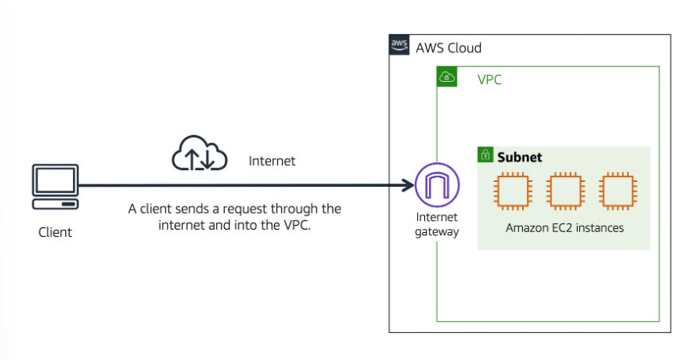
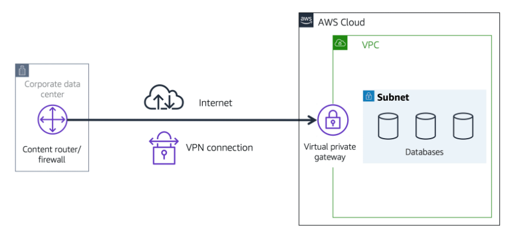

# Networking

# [Amazon VPC](#amazon-vpc)

A networking service that you can use to establish boundaries around your AWS resources is [Amazon Virtual Private Cloud (Amazon VPC)](https://aws.amazon.com/vpc/).

**Amazon VPC enables you to provision an isolated section of the AWS Cloud.** 

In this isolated section, you can launch resources in a virtual network that you define. 

Within a virtual private cloud (VPC), you can organize your resources into subnets. 

**A subnet is a section of a VPC that can contain resources such as Amazon EC2 instances.** Subnets are chunks of IP addresses in your VPC that allow you to group resources together. 

---

## [Public vs Private Facing Resources](#public-vs-private-facing-resources)

In order to allow traffic from the public internet to flow into and out of your VPC, you must attach what is called an **internet gateway**, or IGW, to your VPC. 

In some cases, we want a private gateway that only allows people in if they are coming from an approved network, not the public internet. A **virtual private gateway** allows you to create a VPN connection between a private network, like your on-premises data center or internal corporate network to your VPC. 

---

## [Internet Gateway](#internet-gateway)

**To allow public traffic from the internet to access your VPC, you attach an internet gateway to the VPC.**

An internet gateway is a connection between a VPC and the internet. Without an internet gateway, no one can access the resources within your VPC.

---

## [Virtual Private Gateway](#virtual-private-gateway)

**To access private resources in a VPC, you can use a virtual private gateway.**

A **virtual private network (VPN)** connection encrypts (or protects) your internet traffic from all the other requests around it. A virtual private gateway enables you to establish a virtual private network (VPN) connection between your VPC and a private network.

---

# [Notes](#notes)

- One VPC might have multiple types of gateways attached for multiple types of resources all residing in the same VPC, just in different subnets. 
- The virtual private gateway is the component that allows protected internet traffic to enter into the VPC.
- You work with a Direct Connect partner in your area to establish this connection, because AWS Direct Connect provides a *physical* line that connects your network to your AWS VPC.

---

# References