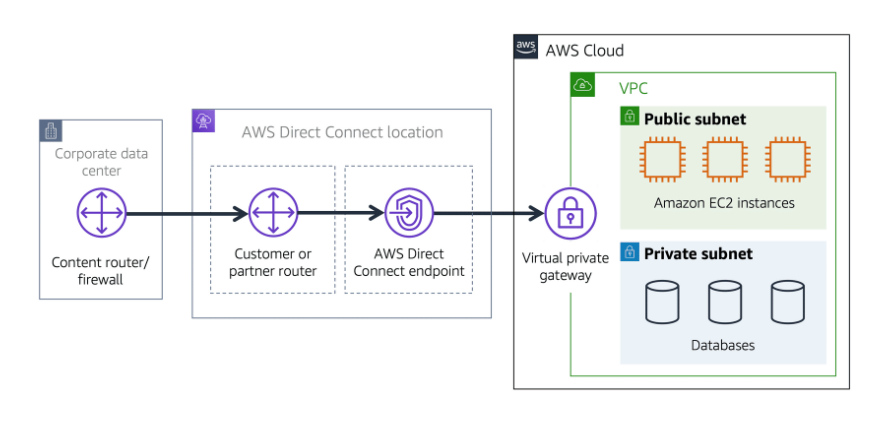
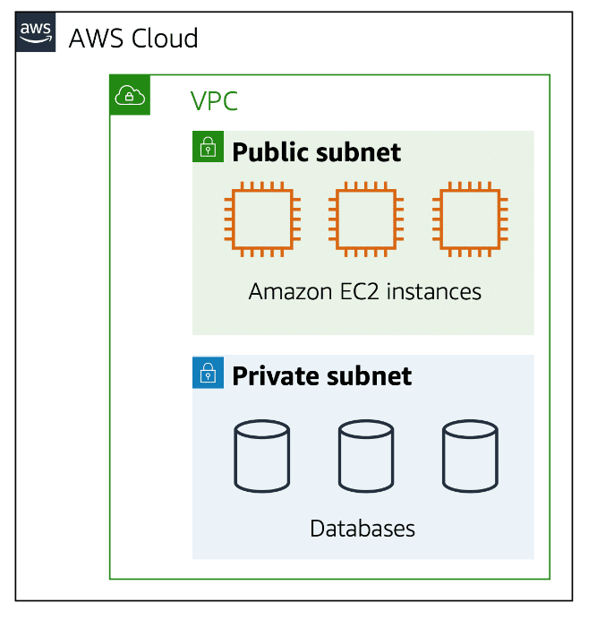
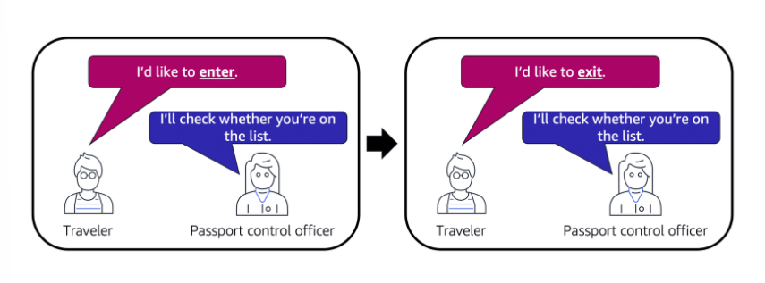
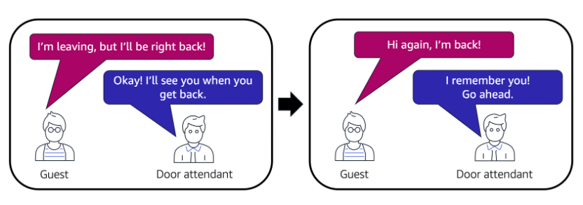
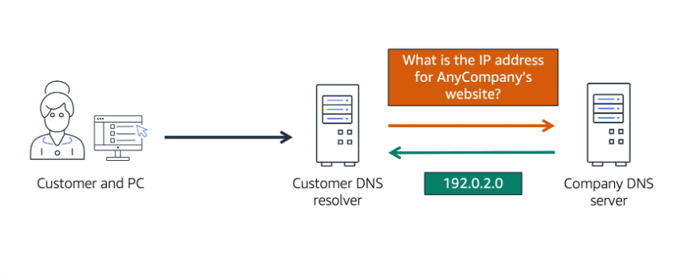
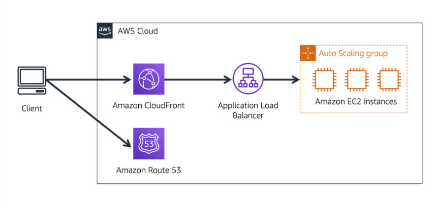
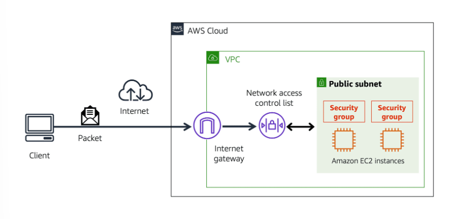

# Networking

# [Amazon VPC](#amazon-vpc)

A networking service that you can use to establish boundaries around your AWS resources is [Amazon Virtual Private Cloud (Amazon VPC)](https://aws.amazon.com/vpc/).

**Amazon VPC enables you to provision an isolated section of the AWS Cloud.** 

In this isolated section, you can launch resources in a virtual network that you define. 

Within a virtual private cloud (VPC), you can organize your resources into subnets. 

**A subnet is a section of a VPC that can contain resources such as Amazon EC2 instances.** Subnets are chunks of IP addresses in your VPC that allow you to group resources together. 

---

## [Public vs Private Facing Resources](#public-vs-private-facing-resources)

In order to allow traffic from the public internet to flow into and out of your VPC, you must attach what is called an **internet gateway**, or IGW, to your VPC. 

In some cases, we want a private gateway that only allows people in if they are coming from an approved network, not the public internet. A **virtual private gateway** allows you to create a VPN connection between a private network, like your on-premises data center or internal corporate network to your VPC. 

---

## [Internet Gateway](#internet-gateway)

**To allow public traffic from the internet to access your VPC, you attach an internet gateway to the VPC.**

An internet gateway is a connection between a VPC and the internet. Without an internet gateway, no one can access the resources within your VPC.

---

## [Virtual Private Gateway](#virtual-private-gateway)

**To access private resources in a VPC, you can use a virtual private gateway.**

A **virtual private network (VPN)** connection encrypts (or protects) your internet traffic from all the other requests around it. A virtual private gateway enables you to establish a virtual private network (VPN) connection between your VPC and a private network.

---

## [AWS Direct Connect](#aws-direct-connect)

**[AWS Direct Connect](https://aws.amazon.com/directconnect/) is a service that enables you to establish a dedicated private connection between your data center and a VPC.**

The private connection that AWS Direct Connect provides helps you to *reduce network costs* and *increase the amount of bandwidth* that can travel through your network.

---

# [Subnets](#subnets)

**A subnet is a section of a VPC in which you can group resources based on security or operational needs. Subnets can be public or private.**

**Public subnets** contain resources that need to be accessible by the public, such as an online store’s website.

**Private subnets** contain resources that should be accessible only through your private network, such as a database.

---

When a customer requests data from an application hosted in the AWS Cloud, this request is sent as a packet. **A packet is a unit of data sent over the internet or a network.** 

It enters into a VPC through an internet gateway. Before a packet can enter into a subnet or exit from a subnet, it checks for permissions. 

**The VPC component that checks packet permissions for subnets is a network access control list (ACL).**

---

# [Network Access Control Lists](#network-access-control-lists)

**A [network access control list (ACL)](https://docs.aws.amazon.com/vpc/latest/userguide/vpc-network-acls.html) is a virtual firewall that controls inbound and outbound traffic at the subnet level.**

Each AWS account includes a default network ACL.

- **By default, your account’s default network ACL allows all inbound and outbound traffic.**

- **For custom network ACLs, all inbound and outbound traffic is denied until you add rules to specify which traffic to allow.**

- **All network ACLs have an explicit deny rule.**

---

## [Stateless packet filtering](#stateless-packet-filtering)

**Network ACLs perform stateless packet filtering.**

They remember nothing and check packets that cross the subnet border each way: inbound and outbound. 

After a packet has entered a subnet, it must have its permissions evaluated for resources within the subnet, such as Amazon EC2 instances. 

**The VPC component that checks packet permissions for an Amazon EC2 instance is a security group.**

---

# [Security Groups](#security-groups)

**A [security group](https://docs.aws.amazon.com/vpc/latest/userguide/VPC_SecurityGroups.html) is a virtual firewall that controls inbound and outbound traffic for an Amazon EC2 instance.**

**By default, a security group denies all inbound traffic and allows all outbound traffic.**

---

## [Stateful packet filtering](#stateful-packet-filtering)

**Security groups perform stateful packet filtering.**

They remember previous decisions made for incoming packets.

---

# [Domain Name System (DNS)](#domain-name-system-dns)

Route 53 is AWS's domain name service. DNS translates website names into IP, or Internet Protocol addresses. 

**DNS resolution is the process of translating a domain name to an IP address.**

---

### [DNS Resolution Example](#dns-resolution-example)

- When you enter the domain name into your browser, this request is sent to a customer DNS resolver. 
- The customer DNS resolver asks the company DNS server for the IP address that corresponds to AnyCompany’s website.
- The company DNS server responds by providing the IP address for AnyCompany’s website, 192.0.2.0.

---

# [Amazon Route 53](#amazon-route-53)

**[Amazon Route 53](https://aws.amazon.com/route53) is a DNS web service.**

* Route end users to internet applications hosted in AWS
* Connect user requests to infrastructure running in AWS (such as Amazon EC2 instances and load balancers)
* Manage the DNS records for domain names
* Register new domain names directly in Route 53
* Transfer DNS records for existing domain names managed by other domain registrars.

---

### [Route 53 and CloudFront Example](#route-53-and-cloudfront-example)

Assumption: AnyCompany’s application is running on several Amazon EC2 instances. These instances are in an Auto Scaling group that attaches to an Application Load Balancer. 

How Route 53 and CloudFront deliver content to customers:
- A customer requests data from the application by going to AnyCompany’s website. 
- Amazon Route 53 uses DNS resolution to identify AnyCompany.com’s corresponding IP address, 192.0.2.0. This information is sent back to the customer. 
- The customer’s request is sent to the nearest edge location through Amazon CloudFront. 
- Amazon CloudFront connects to the Application Load Balancer, which sends the incoming packet to an Amazon EC2 instance.

---

# [Notes](#notes)

- One VPC might have multiple types of gateways attached for multiple types of resources all residing in the same VPC, just in different subnets. 
- The virtual private gateway is the component that allows protected internet traffic to enter into the VPC.
- You work with a Direct Connect partner in your area to establish this connection, because AWS Direct Connect provides a *physical* line that connects your network to your AWS VPC.
- If you have multiple Amazon EC2 instances within a subnet, you can associate them with the same security group or use different security groups for each instance. 
- Both network ACLs and security groups enable you to configure custom rules for the traffic in your VPC. 
- **The key difference between a security group and a network ACL is the security group is stateful**, meaning, it has some kind of a memory when it comes to who to allow in or out, **and the network ACL is stateless**, which remembers nothing and checks every single packet that crosses its border regardless of any circumstances. 
- A CDN is a network that helps to deliver edge content to users based on their geographic location.
- Route 53 can direct traffic to different endpoints using several different routing policies, such as latency-based routing, geolocation DNS, geoproximity, and weighted round robin.

---

# References

- [Networking and Content Delivery on AWS](https://aws.amazon.com/products/networking)
- [AWS Networking and Content Delivery Blog](https://aws.amazon.com/blogs/networking-and-content-delivery/)
- [Amazon Virtual Private Cloud](https://aws.amazon.com/vpc)
- [What is Amazon VPC?](https://docs.aws.amazon.com/vpc/latest/userguide/what-is-amazon-vpc.html)
- [How Amazon VPC works](https://docs.aws.amazon.com/vpc/latest/userguide/how-it-works.html)
