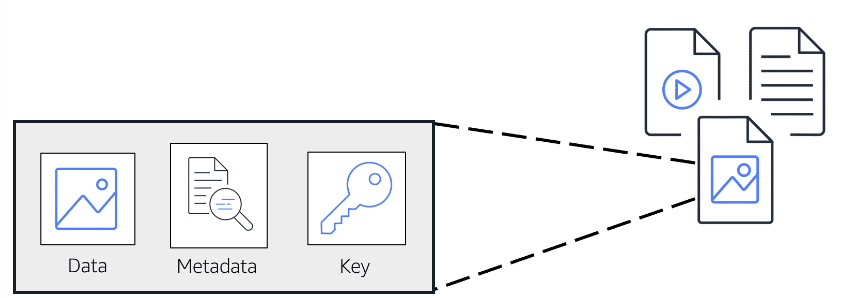

# Storage

# [Instance stores](#instance-stores)

**An [instance store](https://docs.aws.amazon.com/AWSEC2/latest/UserGuide/InstanceStorage.html) provides temporary block-level storage for an Amazon EC2 instance.** 

An instance store is (local) disk storage that is physically attached to the host computer for an EC2 instance, and therefore has the same lifespan as the instance. **When the instance is terminated, you lose any data in the instance store.**

---

# [Amazon EBS](#amazon-ebs)

**[Amazon Elastic Block Store (Amazon EBS)](https://aws.amazon.com/ebs) is a service that provides block-level storage volumes that you can use with Amazon EC2 instances.**

**If you stop or terminate an Amazon EC2 instance, all the data on the attached EBS volume remains available.**

**EBS allows you to take incremental backups of your data called snapshots.**

---

## [Amazon EBS Snapshots](#amazon-ebs-snapshots)

**An [EBS snapshot](https://docs.aws.amazon.com/AWSEC2/latest/UserGuide/EBSSnapshots.html) is an incremental backup.** This means that the first backup taken of a volume copies all the data. For subsequent backups, only the blocks of data that have changed since the most recent snapshot are saved. 

---

# [Object Storage](#object-storage)

**In object storage, each object consists of data, metadata, and a key.**

- The data might be an image, video, text document, or any other type of file. 
- Metadata contains information about what the data is, how it is used, the object size, and so on. 
- An object’s key is its unique identifier.

---

# [Amazon S3](#amazon-s3)

**[Amazon Simple Storage Service (Amazon S3)](https://aws.amazon.com/s3/) is a service that provides object-level storage.** 

- Amazon S3 stores data as objects in buckets.
- Amazon S3 offers **unlimited storage space**. 
- The **maximum** file size for an object in Amazon S3 is **5 TB**.

---

## [Amazon S3 Storage Classes](#amazon-s3-storage-classes)

When selecting an Amazon S3 storage class, consider these two factors:
- How often you plan to retrieve your data
- How available you need your data to be.

### Amazon S3 Standard

- Designed for **frequently** accessed data
- Stores data in a minimum of **three Availability Zones**

### Amazon S3 Standard-Infrequent Access (S3 Standard-IA)

- Ideal for **infrequently** accessed data
- Similar to Amazon S3 Standard but has **a lower storage price and higher retrieval price**\
- Stores data in a minimum of **three Availability Zones**

### Amazon S3 One Zone-Infrequent Access (S3 One Zone-IA)

- Stores data in a **single Availability Zone**
- Has a lower storage price than Amazon S3 Standard-IA
- Use this when want to save costs on storage and/or can easily reproduce your data in the event of an Availability Zone failure

### Amazon S3 Intelligent-Tiering

- Ideal for data with **unknown or changing access patterns**
- Requires a small monthly **monitoring** and automation fee per object
- If you haven’t accessed an object for 30 consecutive days, Amazon S3 automatically moves it to the infrequent access tier, Amazon S3 Standard-IA. 
- If you access an object in the infrequent access tier, Amazon S3 automatically moves it to the frequent access tier, Amazon S3 Standard.

### Amazon S3 Glacier Instant Retrieval

- Works well for **archived data that requires immediate access**
- Can retrieve objects within a few milliseconds

### Amazon S3 Glacier Flexible Retrieval

- Low-cost storage designed for data archiving
- Able to retrieve objects within a few minutes to hours

### Amazon S3 Glacier Deep Archive

- **Lowest-cost** object storage class ideal for archiving
- Able to retrieve objects within 12 hours
- Long-term retention and digital preservation for data that might be accessed once or twice in a year

All objects from this storage class are replicated and stored across at least **three** geographically dispersed Availability Zones.

### Amazon S3 Outposts

- Creates S3 buckets on Amazon S3 Outposts
- Makes it easier to retrieve, store, and access data on AWS Outposts

**Amazon S3 Outposts delivers object storage to your on-premises AWS Outposts environment.**

---

# [Amazon EFS](#amazon-efs)

EFS is a managed file system. In **file storage**, multiple clients can access data that is stored in shared file folders. 

Compared to block storage and object storage, **file storage is ideal for use cases in which a large number of services and resources need to access the same data at the same time.**

**[Amazon Elastic File System (Amazon EFS)](https://aws.amazon.com/efs/) is a scalable file system used with AWS Cloud services and on-premises resources.**

---

## [EBS vs EFS](#ebs-vs-efs)

Amazon EBS volumes attach to EC2 instances and are an **Availability Zone-level resource.** In order to attach EC2 to EBS, you need to be in the same AZ. **EBS doesn't automatically scale.**

EFS allows you to have multiple instances accessing the data in EFS at the same time. It's a **regional resource** and stores data in and across **multiple AZs**, meaning any EC2 instance in the Region can write to the EFS file system. As you write more data to **EFS, it automatically scales.**

---

# [Notes](#notes)

- Amazon EC2 instances are virtual servers. If you start an instance from a stopped state, the instance might start on another host, where the previously used instance store volume does not exist. Therefore, AWS recommends instance stores for use cases that involve temporary data that you do not need in the long term.

- Incremental backups are different from full backups, in which all the data in a storage volume copies each time a backup occurs. The full backup includes data that has not changed since the most recent backup.

- When you modify a file in block storage, only the pieces that are changed are updated. When a file in object storage is modified, the entire object is updated.

- When you decide between the options for archival storage, consider how quickly you must retrieve the archived objects.

- Object storage treats any file as a complete, discreet object. Block storage breaks those files down to small component parts or blocks.

- If you are using complete objects or only occasional changes, S3 is the right choice. If you are doing complex read, write, change functions, then use EBS.

- On-premises servers can access EFS using AWS Direct Connect.

---

# References

- [Cloud Storage on AWS](https://aws.amazon.com/products/storage)
- [AWS Storage Blog](https://aws.amazon.com/blogs/storage/)
- [Hands-On Tutorials: Storage](https://aws.amazon.com/getting-started/hands-on/?awsf.getting-started-category=category%23storage&awsf.getting-started-content-type=content-type%23hands-on)
- [AWS Case Studies: Storage](https://aws.amazon.com/solutions/case-studies/?customer-references-cards.sort-by=item.additionalFields.publishedDate&customer-references-cards.sort-order=desc&awsf.customer-references-location=*all&awsf.customer-references-segment=*all&awsf.customer-references-product=product%23vpc%7Cproduct%23api-gateway%7Cproduct%23cloudfront%7Cproduct%23route53%7Cproduct%23directconnect%7Cproduct%23elb&awsf.customer-references-category=category%23storage)
