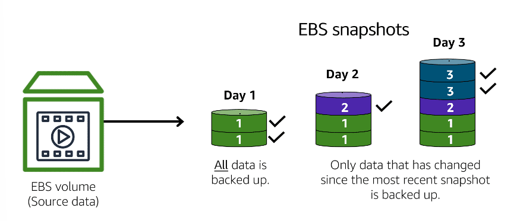

# Storage

# [Instance stores](#instance-stores)

**An [instance store](https://docs.aws.amazon.com/AWSEC2/latest/UserGuide/InstanceStorage.html) provides temporary block-level storage for an Amazon EC2 instance.** 

An instance store is (local) disk storage that is physically attached to the host computer for an EC2 instance, and therefore has the same lifespan as the instance. **When the instance is terminated, you lose any data in the instance store.**

---

# [Amazon EBS](#amazon-ebs)

**[Amazon Elastic Block Store (Amazon EBS)](https://aws.amazon.com/ebs) is a service that provides block-level storage volumes that you can use with Amazon EC2 instances.**

**If you stop or terminate an Amazon EC2 instance, all the data on the attached EBS volume remains available.**

**EBS allows you to take incremental backups of your data called snapshots.**

---

## [Amazon EBS Snapshots](#amazon-ebs-snapshots)

**An [EBS snapshot](https://docs.aws.amazon.com/AWSEC2/latest/UserGuide/EBSSnapshots.html) is an incremental backup.** This means that the first backup taken of a volume copies all the data. For subsequent backups, only the blocks of data that have changed since the most recent snapshot are saved. 

---

# [Notes](#notes)

- Amazon EC2 instances are virtual servers. If you start an instance from a stopped state, the instance might start on another host, where the previously used instance store volume does not exist. Therefore, AWS recommends instance stores for use cases that involve temporary data that you do not need in the long term.

- Incremental backups are different from full backups, in which all the data in a storage volume copies each time a backup occurs. The full backup includes data that has not changed since the most recent backup.

---

# References