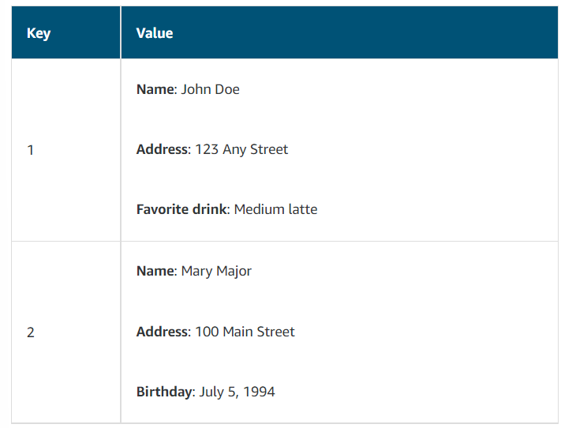

# Databases

# [Relational Databases](#relational-databases)

In a **relational database**, data is stored in a way that relates it to other pieces of data. 

Relational databases use **structured query language (SQL)** to store and query data.

Example of data in a relational database:

---

# [Amazon RDS](#amazon-rds)

**[Amazon Relational Database Service (Amazon RDS)](https://aws.amazon.com/rds/) is a service that enables you to run relational databases in the AWS Cloud.**

Amazon RDS is a managed service that automates tasks such as hardware provisioning, database setup, patching, and backups. 

Many Amazon RDS database engines offer:
-  **encryption at rest** (protecting data while it is stored) and 
- **encryption in transit** (protecting data while it is being sent and received).

---

## [Amazon RDS Database Engines](#amazon-rds-database-engines)

Amazon RDS is available on six database engines, which optimize for memory, performance, or input/output (I/O). 

1. [Amazon Aurora](#amazon-aurora)
2. PostgreSQL
3. MySQL
4. MariaDB
5. Oracle Database
6. Microsoft SQL Server

---

# [Amazon Aurora](#amazon-aurora)

**[Amazon Aurora](https://aws.amazon.com/rds/aurora/) is an enterprise-class relational database.** It is compatible with MySQL and PostgreSQL relational databases.

Consider Amazon Aurora if your workloads require high availability. It replicates **six copies of your data across three Availability Zones** and continuously backs up your data to Amazon S3.

---

# [Nonrelational Databases](#nonrelational-databases)

**Nonrelational databases are sometimes referred to as “NoSQL databases” because they use structures other than rows and columns to organize data.**

With **key-value pairs**, data is organized into items (keys), and items have attributes (values). 

---

# [Amazon DynamoDB](#amazon-dynamodb)

**[Amazon DynamoDB](https://aws.amazon.com/dynamodb/) is a key-value database service.** 

Features:
- **Serverless** 

DynamoDB is serverless which means you don't have to provision, patch or manage servers or install, maintain or operate software.

- **Automatic Scaling**

As the size of your database shrinks or grows, DynamoDB automatically scales to adjust for changes in capacity.

---

### [RDS vs DynamoDB](#rds-vs-dynamodb)

If you need complex relational joins use RDS, because it's built for business analytics. If you don't need complex joint functionality and don't want additional expense, use DynamoDB. 

Scenarios in which you should use RDS:
- Using SQL to organize data
- Storing data in an Amazon Aurora database

Scenarion in which you should use DynamoDB:
- Running a serverless database
- Storing data in a key-value database
- Scaling up to 10 trillion requests per day

---

# [Amazon Redshift](#amazon-redshift)

**[Amazon Redshift](https://aws.amazon.com/redshift) is a data warehousing service that you can use for big data analytics.**

Optimal to use when you are looking at historical analytics as opposed to operational analysis. 

---

# [Amazon Database Migration Service](#amazon-database-migration-service)

**[AWS Database Migration Service (AWS DMS)](https://aws.amazon.com/dms/) enables you to migrate relational databases, nonrelational databases, and other types of data stores.**

With AWS DMS, you move data between a **source** database and a **target** database. 

[The source and target databases](https://aws.amazon.com/dms/resources) can be of the same type or different types. 

**Use cases for AWS DMS:**
- Development and test database migrations
- Database consolidation 
- Continuous replication

Click [here](#notes) for learn more about these use cases.

Migration types:

- **Homogenous migration** - when source and target databases are of the same type.
- **Heterogeneous migration** - when source and target databases are of different types.

Heterogeneous migration consists of two steps:

- Since the schema structures, data types, and database code are different between source and target, we first need to convert them using the **AWS Schema Conversion Tool.** This will convert the source schema and code to match that of the target database.
- Use DMS to migrate data from the source database to the target database. 

---

# [Amazon DocumentDB](#amazon-documentdb)

**[Amazon DocumentDB](https://aws.amazon.com/documentdb) is a document database service that supports MongoDB workloads.**

Amazon DocumentDB is great for content management, catalogs, user profiles. 

---

# [Amazon Neptune](#amazon-neptune)

**[Amazon Neptune](https://aws.amazon.com/neptune) is a graph database service.** 

You can use Amazon Neptune to build and run applications that work with highly connected datasets, such as recommendation engines, fraud detection, and knowledge graphs.

---

# [Amazon QLDB](#amazon-qldb)

**[Amazon Quantum Ledger Database (Amazon QLDB)](https://aws.amazon.com/qldb) is a ledger database service.**

You can use Amazon QLDB to review a complete history of all the changes that have been made to your application data.

---

# [Amazon Managed Blockchain](#amazon-managed-blockchain)

**[Amazon Managed Blockchain](https://aws.amazon.com/managed-blockchain) is a service that you can use to create and manage blockchain networks with open-source frameworks.**

**Blockchain** is a distributed ledger system that lets multiple parties run transactions and share data without a central authority.

---

# [Amazon ElastiCache](#amazon-elasticache)

**[Amazon ElastiCache](https://aws.amazon.com/elasticache) is a service that adds caching layers on top of your databases to help improve the read times of common requests.** 

It supports two types of data stores: Redis and Memcached.

---

# [Amazon DynamoDB Accelerator](#amazon-dynamodb-accelerator)

**[Amazon DynamoDB Accelerator (DAX)](https://aws.amazon.com/dynamodb/dax/) is an in-memory cache for DynamoDB.** 

It helps improve response times from single-digit milliseconds to microseconds.

---

# [Notes](#notes)

- In cooperation with **Amazon Redshift Spectrum**, you can directly run a single SQL query against exabytes of unstructured data running in data lakes. 

- During the migration, the source database remains operational, minimizing downtime to applications that rely on that database. 

- **Development and test migration** is when you want to develop this to test against production data, but without affecting production users. 

- **Database consolidation** is when you have several databases and want to consolidate them into one central database. 

- **Continuous replication** is when you use DMS to perform continuous data replication. This could be for disaster recovery or because of geographic separation. 

- MongoDB is a document database program.

- Amazon QLDB, or Quantum Ledger Database: an immutable system of record where any entry can never be removed from the audits. 

- DAX, the DynamoDB Accelerator, is a native caching layer designed to dramatically improve read times for nonrelational data. 

---

# References

- [AWS Database Migration Service](https://aws.amazon.com/dms/)
- [Databases on AWS](https://aws.amazon.com/products/databases)
- [Category Deep Dive: Databases](https://aws.amazon.com/getting-started/deep-dive-databases/)
- [AWS Database Blog](https://aws.amazon.com/blogs/database/)
- [AWS Case Studies: Databases](https://aws.amazon.com/solutions/case-studies/?customer-references-cards.sort-by=item.additionalFields.publishedDate&customer-references-cards.sort-order=desc&awsf.customer-references-location=*all&awsf.customer-references-segment=*all&awsf.customer-references-product=product%23vpc%7Cproduct%23api-gateway%7Cproduct%23cloudfront%7Cproduct%23route53%7Cproduct%23directconnect%7Cproduct%23elb&awsf.customer-references-category=category%23databases)