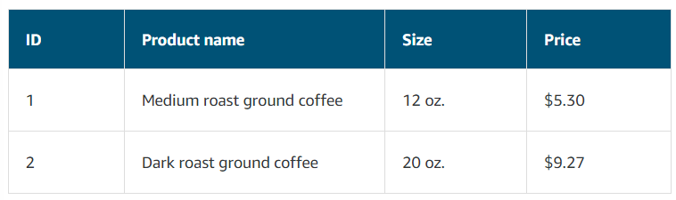

# Databases

# [Relational Databases](#relational-databases)

In a **relational database**, data is stored in a way that relates it to other pieces of data. 

Relational databases use **structured query language (SQL)** to store and query data.

Example of data in a relational database:

---

# [Amazon RDS](#amazon-rds)

**[Amazon Relational Database Service (Amazon RDS)](https://aws.amazon.com/rds/) is a service that enables you to run relational databases in the AWS Cloud.**

Amazon RDS is a managed service that automates tasks such as hardware provisioning, database setup, patching, and backups. 

Many Amazon RDS database engines offer:
-  **encryption at rest** (protecting data while it is stored) and 
- **encryption in transit** (protecting data while it is being sent and received).

---

## [Amazon RDS Database Engines](#amazon-rds-database-engines)

Amazon RDS is available on six database engines, which optimize for memory, performance, or input/output (I/O). 

1. [Amazon Aurora](#amazon-aurora)
2. PostgreSQL
3. MySQL
4. MariaDB
5. Oracle Database
6. Microsoft SQL Server

---

# [Amazon Aurora](#amazon-aurora)

# [Notes](#notes)

---

# References