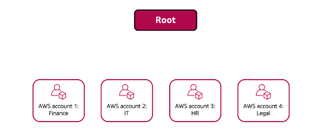
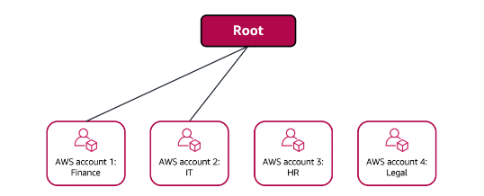
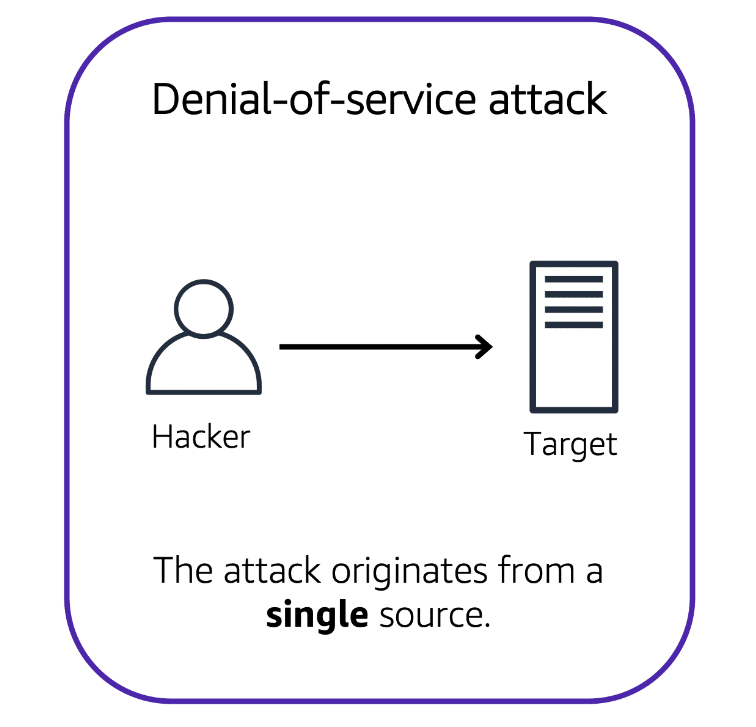
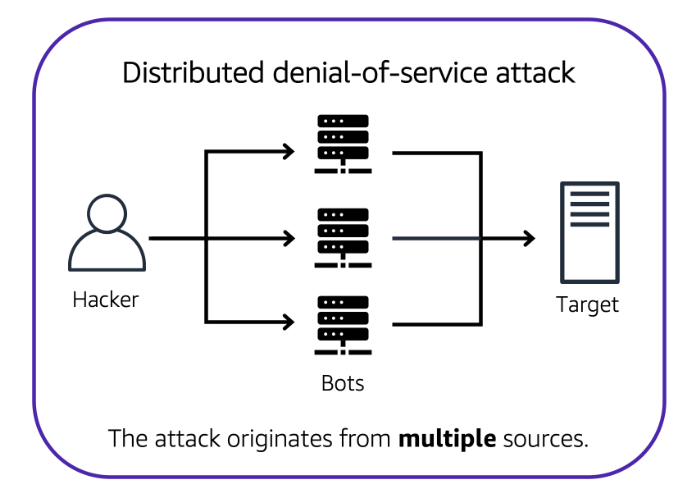
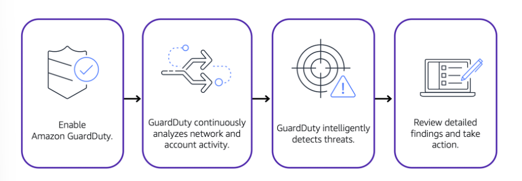

# Security

# [Shared Responsibility Model](#shared-responsibility-model)

AWS is responsible for some parts of your environment and you (the customer) are responsible for other parts. This concept is known as the **[shared responsibility model](https://aws.amazon.com/compliance/shared-responsibility-model)**.

The shared responsibility model divides into:
-  **customer responsibilities** (commonly referred to as “security in the cloud”) and 
- **AWS responsibilities** (commonly referred to as “security of the cloud”).

Customers are responsible for the security of everything that they create and put in the AWS Cloud.

---

# [AWS IAM](#aws-iam)

**[AWS Identity and Access Management (IAM)](https://aws.amazon.com/iam/) enables you to manage access to AWS services and resources securely.**  

Some features:
- IAM users, groups, and roles
- IAM policies
- MFA (Multi-factor authentication)

---

## [AWS account root user](#aws-account-root-user)

When you first create an AWS account, you begin with an identity known as the [root user](https://docs.aws.amazon.com/IAM/latest/UserGuide/id_root-user.html). It has complete access to all the AWS services and resources in the account.

**Best practice:**

Use cases:
- to change the root user email address
- to change AWS support plan.

---

## [IAM users](#iam-users)

**An IAM user is an identity that you create in AWS.** It represents the person or application that interacts with AWS services and resources. It consists of a name and credentials.

By default, when you create a new IAM user in AWS, it has no permissions associated with it. 

---

## [IAM policies](#iam-policies)

**An IAM policy is a document that allows or denies permissions to AWS services and resources.**  

Follow the security principle of **least privilege** when granting permissions. By following this principle, you help to prevent users or roles from having more permissions than needed to perform their tasks.

Instead of assigning permissions to each individual IAM user, place the users into an IAM group.

---

## [IAM groups](#iam-groups)
 
**An [IAM group](https://docs.aws.amazon.com/IAM/latest/UserGuide/id_groups.html) is a collection of IAM users.**
 
When you assign an IAM policy to a group, all users in the group are granted permissions specified by the policy.

---

## [IAM roles](#iam-roles)

**An IAM role is an identity that you can assume to gain temporary access to permissions.**

When someone assumes an IAM role, they abandon all previous permissions that they had under a previous role and assume the permissions of the new role. 

---

# [AWS Organizations](#aws-organizations)

**You can use [AWS Organizations](https://aws.amazon.com/organizations) to consolidate and manage multiple AWS accounts within a central location.**

When you create an organization, AWS Organizations automatically creates a **root**, which is the parent container for all the accounts in your organization. 

**In AWS Organizations, you can centrally control permissions for the accounts in your organization by using [service control policies (SCPs)](https://docs.aws.amazon.com/organizations/latest/userguide/orgs_manage_policies_scps.html).** 

**SCPs enable you to place restrictions on the AWS services, resources, and individual API actions that users and roles in each account can access.**

**SCPs** can be applied to:
- an individual member account
- an organizational unit (OU)

Features:
- centralized management of all your AWS accounts
- consolidated billing 
- implement hierarchical groupings of your accounts to meet security, compliance, or budgetary needs (group accounts into organizational units)
- have control over the AWS services and API actions that each account can access as an administrator of the primary account of an organization (SCPs).

---

## [Organizational units](#organizational-units)

**In AWS Organizations, you can group accounts into organizational units (OUs) to make it easier to manage accounts with similar business or security requirements.** 

When you apply a policy to an OU, all the accounts in the OU automatically inherit the permissions specified in the policy.  

---

## [Example: How to use AWS Organizations](#example-how-to-use-aws-organizations)

A company has separate AWS accounts for the finance, information technology (IT), human resources (HR), and legal departments. You decide to consolidate these accounts into a single organization so that you can administer them from a central location. When you create the organization, this establishes the root.

The finance and IT departments have requirements that do not overlap with those of any other department. You bring these accounts into your organization to take advantage of benefits such as consolidated billing, but you do not place them into any OUs.

The HR and legal departments need to access the same AWS services and resources, so you place them into an OU together. Placing them into an OU enables you to attach policies that apply to both the HR and legal departments’ AWS accounts.

---

# [Compliance](#compliance)

## [AWS Artifact](#aws-artifact)

**[AWS Artifact](https://aws.amazon.com/artifact) is a service that provides on-demand access to AWS security and compliance reports and select online agreements.**

AWS Artifact consists of two main sections: 
- **AWS Artifact Agreements** and 
- **AWS Artifact Reports**.

In **AWS Artifact Agreements**, you can review, accept, and manage agreements for an individual account and for all your accounts in AWS Organizations. 

**AWS Artifact Reports** provide compliance reports from third-party auditors. 

---

## [Customer Compliance Center](#customer-compliance-center)

**The [Customer Compliance Center](https://aws.amazon.com/compliance/customer-center/) contains resources to help you learn more about AWS compliance.**

What can you find here?
- AWS answers to key compliance questions
- An overview of AWS risk and compliance
- An auditing security checklist.

---

# [Denial-of-Service Attacks](#denial-of-service-attacks)

**A denial-of-service (DoS) attack is a deliberate attempt to make a website or application unavailable to users.**

**In a distributed denial-of-service (DDoS) attack, multiple sources are used to start an attack that aims to make a website or application unavailable.**

The single attacker can use multiple infected computers (also known as “bots”) to send excessive traffic to a website or application.

---

# [AWS Shield](#aws-shield)

To help minimize the effect of DoS and DDoS attacks on your applications, you can use [AWS Shield](https://aws.amazon.com/shield).

**AWS Shield is a service that protects applications against DDoS attacks.**

AWS Shield provides two levels of protection: 
- Standard 
- Advanced.

**AWS Shield Standard automatically protects all AWS customers at no cost.** It protects your AWS resources from the most common, frequently occurring types of DDoS attacks.

**AWS Shield Advanced is a paid service that provides detailed attack diagnostics and the ability to detect and mitigate sophisticated DDoS attacks.** 

It also integrates with other services such as Amazon CloudFront, Amazon Route 53, and Elastic Load Balancing. 

Additionally, you can integrate AWS Shield with AWS WAF by writing custom rules to mitigate complex DDoS attacks.

---

# [AWS KMS](#aws-kms)

You must ensure that your applications’ data is secure while in storage **(encryption at rest)** and while it is transmitted, known as **encryption in transit.**

**[AWS Key Management Service (AWS KMS)](https://aws.amazon.com/kms) enables you to perform encryption operations through the use of cryptographic keys.**

A cryptographic key is a random string of digits used for locking (encrypting) and unlocking (decrypting) data. 

---

# [AWS WAF](#aws-waf)

**[AWS WAF](https://aws.amazon.com/waf) is a web application firewall that lets you monitor network requests that come into your web applications.**

It does this by using a [web access control list (ACL)](https://docs.aws.amazon.com/waf/latest/developerguide/web-acl.html) to protect your AWS resources. 

AWS WAF works together with Amazon CloudFront and an Application Load Balancer.

---

# [Amazon Inspector](#amazon-inspector)

**[Amazon Inspector](https://aws.amazon.com/inspector/) helps to improve security, and compliance of your AWS deployed applications by running an automated security assessment against your infrastructure.**

The service consists of three parts:
*  a network configuration reachability piece, 
* an Amazon agent, which can be installed an EC2 instances, and 
* a security assessment service that brings them all together. 

---

# [Amazon GuardDuty](#amazon-guardduty)

**[Amazon GuardDuty](https://aws.amazon.com/guardduty) is a service that provides intelligent threat detection for your AWS infrastructure and resources.**

It identifies threats by continuously monitoring the network activity and account behavior within your AWS environment.

It analyzes continuous streams of metadata generated from your account, and network activity found on AWS CloudTrail events, Amazon VPC Flow Logs, and DNS logs. 

---

# [Notes](#notes)

- An IAM policy is a JSON document that describes what API calls a user can or cannot make. 
- Roles have associated permissions that allow or deny specific actions.
- Before an IAM user, application, or service can assume an IAM role, they must be granted permissions to switch to the role.
- In IAM, multi-factor authentication (MFA) provides an extra layer of security for your AWS account.
- AWS MFA device. This device could be a hardware security key, a hardware device, or an MFA application on a device such as a smartphone.
- Suppose that your company needs to sign an agreement with AWS regarding your use of certain types of information throughout AWS services. You can do this through AWS Artifact Agreements. 
- Suppose that a member of your company’s development team is building an application and needs more information about their responsibility for complying with certain regulatory standards. You can advise them to access this information in AWS Artifact Reports.
- AWS Compliance Center can be used to find compliance information all in one place. It will show you compliance enabling services as well as documentation like the AWS Risk and Security Whitepaper, which you should read to ensure that you understand security and compliance with AWS. 
- The objective of a DDoS attack is to shut down your application's ability to function by overwhelming the system to the point it can no longer operate. 
- The low level network attacks like the UDP floods. Solution, security groups. 
-  Slowloris attacks? Elastic load balancer (runs on Region level)
-  AWS WAF uses a web application firewall to filter incoming traffic for the signatures of bad actors. 
- Server-side encryption at rest is enabled on all DynamoDB table data. DynamoDB's encryption at rest also integrates with AWS KMS. 
- When a request comes into AWS WAF, it checks against the list of rules that you have configured in the web ACL. If a request did not come from one of the blocked IP addresses, it allows access to the application.
- The service consists of three parts a network configuration reachability piece, an Amazon agent, which can be installed an EC2 instances, and a security assessment service that brings them all together. 

---

# References

- [Multi-factor Authentication](https://aws.amazon.com/iam/features/mfa/)
- [Attaching SCPs](https://docs.aws.amazon.com/organizations/latest/userguide/orgs_manage_policies_scps_attach.html)
- [AWS IAM: Policies and Permissions](https://docs.aws.amazon.com/IAM/latest/UserGuide/access_policies.html)
- [IAM roles](https://docs.aws.amazon.com/IAM/latest/UserGuide/id_roles.html)
- [Security Best Practices in IAM](https://docs.aws.amazon.com/IAM/latest/UserGuide/best-practices.html)
- [AWS Shield](https://aws.amazon.com/shield/)
- [Security, Identity, and Compliance on AWS](https://aws.amazon.com/products/security)
- [Introduction to AWS Security](https://docs.aws.amazon.com/whitepapers/latest/introduction-aws-security/welcome.html) (*whitepaper*)
- [AWS - Overview of Security Processes](https://docs.aws.amazon.com/whitepapers/latest/aws-overview-security-processes/aws-overview-security-processes.pdf) (*whitepaper*)
- [AWS Security Blog](https://aws.amazon.com/blogs/security/)
- [Case Study: Security, Identity, and Compliance](https://aws.amazon.com/blogs/security/)
