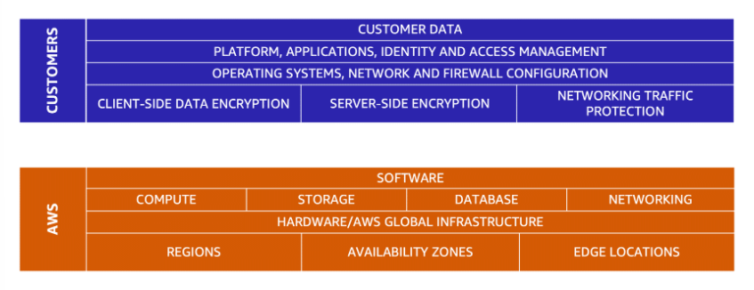
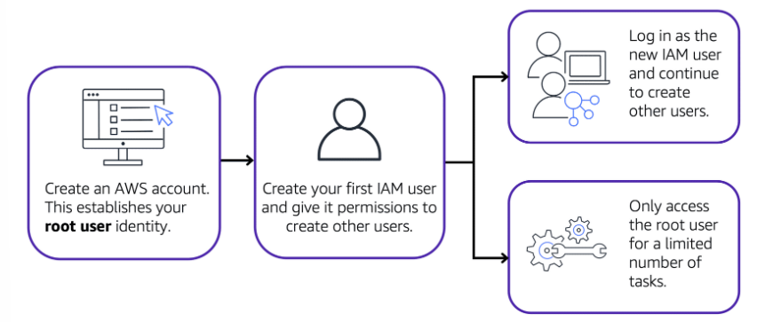

# Security

# [Shared Responsibility Model](#shared-responsibility-model)

AWS is responsible for some parts of your environment and you (the customer) are responsible for other parts. This concept is known as the **[shared responsibility model](https://aws.amazon.com/compliance/shared-responsibility-model)**.

The shared responsibility model divides into:
-  **customer responsibilities** (commonly referred to as “security in the cloud”) and 
- **AWS responsibilities** (commonly referred to as “security of the cloud”).

Customers are responsible for the security of everything that they create and put in the AWS Cloud.

---

# [AWS IAM](#aws-iam)

**[AWS Identity and Access Management (IAM)](https://aws.amazon.com/iam/) enables you to manage access to AWS services and resources securely.**  

Some features:
- IAM users, groups, and roles
- IAM policies
- MFA (Multi-factor authentication)

---

## [AWS account root user](#aws-account-root-user)

When you first create an AWS account, you begin with an identity known as the [root user](https://docs.aws.amazon.com/IAM/latest/UserGuide/id_root-user.html). It has complete access to all the AWS services and resources in the account.

**Best practice:**

Use cases:
- to change the root user email address
- to change AWS support plan.

---

## [IAM users](#iam-users)

**An IAM user is an identity that you create in AWS.** It represents the person or application that interacts with AWS services and resources. It consists of a name and credentials.

By default, when you create a new IAM user in AWS, it has no permissions associated with it. 

---

## [IAM policies](#iam-policies)

**An IAM policy is a document that allows or denies permissions to AWS services and resources.**  

Follow the security principle of **least privilege** when granting permissions. By following this principle, you help to prevent users or roles from having more permissions than needed to perform their tasks.

Instead of assigning permissions to each individual IAM user, place the users into an IAM group.

---

## [IAM groups](#iam-groups)
 
**An [IAM group](https://docs.aws.amazon.com/IAM/latest/UserGuide/id_groups.html) is a collection of IAM users.**
 
When you assign an IAM policy to a group, all users in the group are granted permissions specified by the policy.

---

## [IAM roles](#iam-roles)

**An IAM role is an identity that you can assume to gain temporary access to permissions.**

When someone assumes an IAM role, they abandon all previous permissions that they had under a previous role and assume the permissions of the new role. 

---

# [Notes](#notes)

- An IAM policy is a JSON document that describes what API calls a user can or cannot make. 
- Roles have associated permissions that allow or deny specific actions.
- Before an IAM user, application, or service can assume an IAM role, they must be granted permissions to switch to the role.
- In IAM, multi-factor authentication (MFA) provides an extra layer of security for your AWS account.
- AWS MFA device. This device could be a hardware security key, a hardware device, or an MFA application on a device such as a smartphone.

---

# References

- [Multi-factor Authentication](https://aws.amazon.com/iam/features/mfa/)