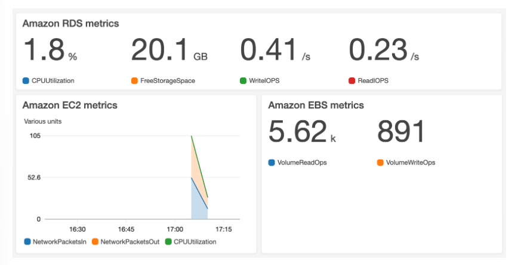
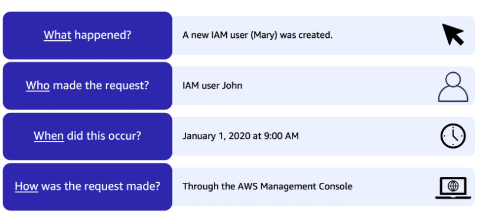

# Monitoring and Analytics

# [Amazon CloudWatch](#amazon-cloudwatch)

**[Amazon CloudWatch](https://aws.amazon.com/cloudwatch/) is a web service that enables you to monitor and manage various metrics and configure alarm actions based on data from those metrics.**

CloudWatch uses [metrics](https://docs.aws.amazon.com/AmazonCloudWatch/latest/monitoring/working_with_metrics.html) to represent the data points for your resources. AWS services send metrics to CloudWatch. 

**With CloudWatch, you can create [alarms](https://docs.aws.amazon.com/AmazonCloudWatch/latest/monitoring/AlarmThatSendsEmail.html) that automatically perform actions if the value of your metric has gone above or below a predefined threshold.** 

**The CloudWatch [dashboard](https://docs.aws.amazon.com/AmazonCloudWatch/latest/monitoring/CloudWatch_Dashboards.html) feature enables you to access all the metrics for your resources from a single location.**

---

# [AWS CloudTrail](#aws-cloudtrail)

**[AWS CloudTrail](https://aws.amazon.com/cloudtrail/) records API calls for your account.** 

The recorded information includes the identity of the API caller, the time of the API call, the source IP address of the API caller, and more. With CloudTrail, you can view a complete history of user activity and API calls for your applications and resources. 

Events are typically updated in CloudTrail within 15 minutes after an API call. 

*Example: A new user was created. Apply a filter to display only the events for the “CreateUser” API action in IAM*

---

## [CloudTrail Insights](#cloudtrail-insights)

Within CloudTrail, you can also enable [CloudTrail Insights](https://docs.aws.amazon.com/awscloudtrail/latest/userguide/logging-insights-events-with-cloudtrail.html). 

**This optional feature allows CloudTrail to automatically detect unusual API activities in your AWS account.** 

*For example, CloudTrail Insights might detect that a higher number of Amazon EC2 instances than usual have recently launched in your account.*

---

# Notes

- CloudWatch alarms are integrated with SNS.

---

# References