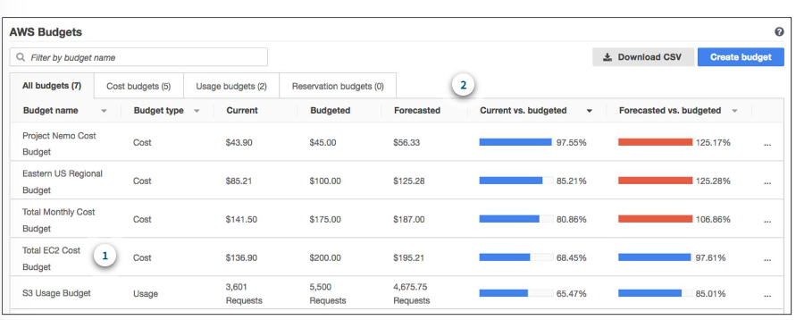
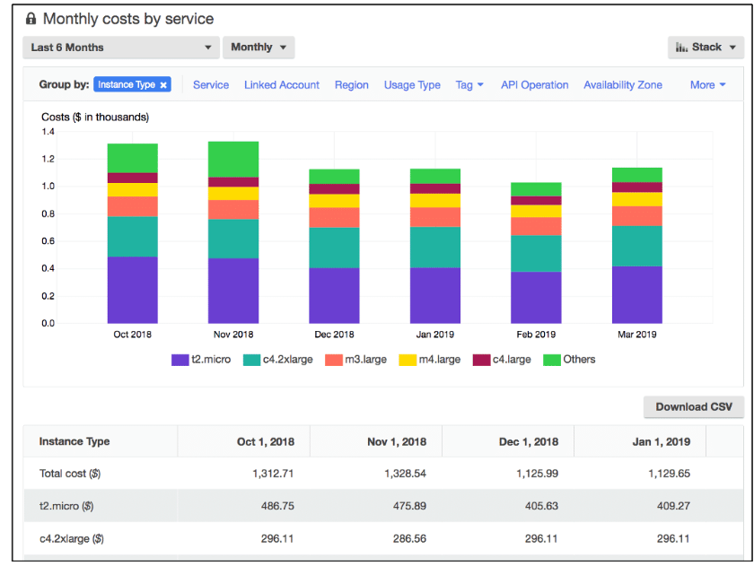
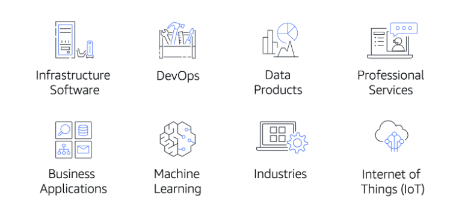

# Pricing and Support

# [AWS Free Tier](#aws-free-tier)

**The [AWS Free Tier](https://aws.amazon.com/free/) enables you to begin using certain services without having to worry about incurring costs for the specified period.**

Three types of offers are available: 
- Always Free
- 12 Months Free
- Trials

---

### [Always free](#always-free)

These offers do not expire and are available to all AWS customers.

Examples:
-  AWS Lambda allows 1 million free requests and up to 3.2 million seconds of compute time per month. 
- Amazon DynamoDB allows 25 GB of free storage per month.

---

### [12 Months Free](#12-months-free)

These offers are free for 12 months following your initial sign-up date to AWS.

Examples:
- specific amounts of Amazon S3 Standard Storage, 
- thresholds for monthly hours of Amazon EC2 compute time, 
- amounts of Amazon CloudFront data transfer out.

---

### [Trials](#trials)

Short-term free trial offers start from the date you activate a particular service.

Examples:
- Amazon Inspector offers a 90-day free trial. 
- Amazon Lightsail offers 750 free hours of usage over a 30-day period.

---

# [How AWS Pricing Works](#how-aws-pricing-works)

AWS offers a range of cloud computing services with pay-as-you-go pricing. 

**Categories:**
1. **Pay for what you use.** For each service, you pay for exactly the amount of resources that you actually use, without requiring long-term contracts or complex licensing. 
2. **Pay less when you reserve.** Some services offer reservation options that provide a significant discount compared to On-Demand Instance pricing.
3. **Pay less with volume-based discounts when you use more.** Some services offer tiered pricing, so the per-unit cost is incrementally lower with increased usage.

---

# [AWS Pricing Calculator](#aws-pricing-calculator)

**[The AWS Pricing Calculator](https://calculator.aws/#/) lets you explore AWS services and create an estimate for the cost of your use cases on AWS.**

You can organize your AWS estimates by groups that you define. A group can reflect how your company is organized, such as providing estimates by cost center.

---

# [AWS Pricing Examples](#aws-pricing-examples)

## [AWS Lambda Pricing](#aws-lambda-pricing)

- You are charged based on the number of requests for your functions and the time that it takes for them to run.
- **1 million free requests** and up to **3.2 million seconds** of compute time per month.

You can save on AWS Lambda costs by signing up for a Compute Savings Plan. **A Compute Savings Plan offers lower compute costs in exchange for committing to a consistent amount of usage over a 1-year or 3-year term.** This is an example of **paying less when you reserve**. 

---

## [AWS EC2 Pricing](#aws-ec2-pricing)

- You pay for only the compute time that you use while your instances are running.
- For some workloads, you can significantly reduce Amazon EC2 costs by using Spot Instances. *For example, suppose that you are running a batch processing job that is able to withstand interruptions.*
- You can find additional cost savings for Amazon EC2 by considering Savings Plans and Reserved Instances.

---

## [AWS S3 Pricing](#aws-s3-pricing)

Consider the following cost components.

### [1. Storage](#1-storage)

You pay for only the storage that you use. You are charged based on:
- the objects' sizes
- storage classes
- how long you have stored each object during the month.

### [2. Request and data retrievals](#2-request-and-data-retrievals)

You pay for requests made to your Amazon S3 objects and buckets.

### [3. Data transfer](#3-data-transfer)

There is **no cost** to transfer data between different Amazon S3 buckets or from Amazon S3 to other services within the same AWS Region.

You **pay for data that you transfer into and out of Amazon S3**, with a few exceptions.

There is **no cost for data transferred into Amazon S3 from the internet or out to Amazon CloudFront**. 

There is also **no cost for data transferred out to an Amazon EC2 instance in the same AWS Region as the Amazon S3 bucket**.

### [4. Management and replication](#4-management-and-replication)

You pay for the storage management features that you have enabled on your account’s Amazon S3 buckets. These features include Amazon S3 inventory, analytics, and object tagging.

---

For each Region, charges are based on the following factors:
- The number of requests to add or copy objects into a bucket
- The number of requests to retrieve objects from a bucket
- The amount of storage space used.

---

# [Billing Dashboards](#billing-dashboards)

**Use the [AWS Billing & Cost Management dashboard](https://docs.aws.amazon.com/awsaccountbilling/latest/aboutv2/billing-what-is.html) to pay your AWS bill, monitor your usage, and analyze and control your costs.**

And more:

- Compare your current month-to-date balance with the previous month, and get a forecast of the next month based on current usage.
- View month-to-date spend by service.
- View Free Tier usage by service.
- Access Cost Explorer and create budgets.
- Purchase and manage Savings Plans.
- Publish [AWS Cost and Usage Reports](https://docs.aws.amazon.com/cur/latest/userguide/what-is-cur.html).

---

# [Consolidated Billing](#consolidated-billing)

**The [consolidated billing](https://docs.aws.amazon.com/awsaccountbilling/latest/aboutv2/consolidated-billing.html) feature of AWS Organizations enables you to receive a single bill for all AWS accounts in your organization.**

**The default maximum number of accounts allowed for an organization is 4**, but you can contact AWS Support to increase your quota, if needed.

A **benefit** of consolidated billing is the ability to **share bulk discount pricing, Savings Plans, and Reserved Instances** across the accounts in your organization. 

---

# [AWS Budgets](#aws-budgets)

**In [AWS Budgets](https://aws.amazon.com/aws-cost-management/aws-budgets), you can create budgets to plan your service usage, service costs, and instance reservations.**

The information in AWS Budgets updates three times a day. 

In AWS Budgets, you can also set custom alerts when your usage exceeds (or is forecasted to exceed) the budgeted amount.

---

# [AWS Cost Explorer](#aws-cost-explorer)

**[AWS Cost Explorer](https://aws.amazon.com/aws-cost-management/aws-cost-explorer/) is a tool that enables you to visualize, understand, and manage your AWS costs and usage over time.**

AWS Cost Explorer includes a default report of the costs and usage for your top five cost-accruing AWS services and it gives you 12 months of historical data, so you can track your spending over time.

---

# [AWS Support Plans](#aws-support-plans)

**AWS offers four different [Support plans](https://aws.amazon.com/premiumsupport/plans/) to help you troubleshoot issues, lower costs, and efficiently use AWS services.** 

In general, for pricing, **the Developer plan has the lowest cost**, the Business and Enterprise On-Ramp plans are in the middle, and **the Enterprise plan has the highest cost.**

## [1. Basic](#1-basic)

Basic Support is free for all AWS customers. It includes access to whitepapers, documentation, and support communities.

With Basic Support, you have access to a **limited selection of AWS Trusted Advisor checks.** 

Additionally, you can use the **AWS Personal Health Dashboard, a tool that provides alerts and remediation guidance when AWS is experiencing events that may affect you.** 

## [2. Developer](#2-developer)

Features:
- Best practice guidance
- Client-side diagnostic tools
- Building-block architecture support, which consists of guidance for how to use AWS offerings, features, and services together.

You can email customer support directly with a 24 hour response time on any questions you have. And responses of less than 12 hours in case your systems are impaired.

## [3. Business](#3-business)

Features:
- Use-case guidance to identify AWS offerings, features, and services that can best support your specific needs
- All AWS Trusted Advisor checks
- Limited support for third-party software, such as common operating systems and application stack components.

You are given direct phone access to AWS support team that has a four hour response SLA. Access to infrastructure event management.

## [4 Enterprise](#4-enterprise)

### [Enterprise On-Ramp Support](#enterprise-on-ramp-support)

Features:
- A pool of Technical Account Managers to provide proactive guidance and coordinate access to programs and AWS experts
- A Cost Optimization workshop (one per year)
- A Concierge support team for billing and account assistance
- Tools to monitor costs and performance through Trusted Advisor and Health API/Dashboard

### [Enterprise Support](#enterprise-support)

Features:
- Operations Reviews and tools to monitor health
- Training and Game Days to drive innovation
- Consultative review and architecture guidance
- Infrastructure Event Management support
- Support automation workflows
- 15 minutes or less response time for business-critical issues

---

# [Technical Account Manager](#technical-account-manager)

**The Enterprise On-Ramp and Enterprise Support plans include access to a Technical Account Manager (TAM).**

The TAM is your primary point of contact at AWS. 

---

# [AWS Marketplace](#aws-marketplace)

**[AWS Marketplace](https://aws.amazon.com/marketplace) is a digital catalog that includes thousands of software listings from independent software vendors.** AWS Marketplace offers products in several categories.

---

# [Notes](#notes)

- S3 us free for 12 months for up to five gigs of storage.
- Amazon Lightsail is a service that enables you to run virtual private servers.
- **Pay less when you reserve** *Example*: suppose that your company is using Amazon EC2 instances for a workload that needs to run continuously. You might choose to run this workload on Amazon EC2 Instance Savings Plans, because the plan allows you to save up to 72% over the equivalent On-Demand Instance capacity.
- **Pay less with volume-based discounts when you use more** *Example*:  The more Amazon S3 storage space you use, the less you pay for it per GB.
- AWS Organizations is a service that enables you to manage multiple AWS accounts from a central location. AWS Organizations also provides the option for consolidated billing. 
- Consolidated billing  enables you to share volume pricing discounts across accounts. 
- In Amazon S3, after customers have transferred 10 TB of data in a month, they pay a lower per-GB transfer price for the next 40 TB of data transferred. 
- Developer, Business, Enterprise On-Ramp, and Enterprise Support - *These Support plans have pay-by-the-month pricing and require no long-term contracts.*
- Only the Business, Enterprise On-Ramp, and Enterprise Support plans include all AWS Trusted Advisor checks. Of these three Support plans, the Business Support plan has a lower cost.
---

# References

- [Introduction to AWS Economics](https://d1.awsstatic.com/whitepapers/introduction-to-aws-cloud-economics-final.pdf) *whitepaper*
- [AWS Pricing](https://aws.amazon.com/pricing)
- [How AWS Pricing Works](https://d1.awsstatic.com/whitepapers/aws_pricing_overview.pdf) *whitepaper*
- [AWS Free Tier](https://aws.amazon.com/free)
- [AWS S3 Pricing](https://aws.amazon.com/s3/pricing/)
- [AWS EC2 Pricing](https://aws.amazon.com/ec2/pricing/)
- [AWS Lambda Pricing](https://aws.amazon.com/lambda/pricing/)
- [AWS Support](https://aws.amazon.com/premiumsupport/plans/)
- [AWS Cost Management](https://aws.amazon.com/aws-cost-management/)
- [Compare AWS Support Plans](https://aws.amazon.com/premiumsupport/plans/)
- [AWS Knowledge Center](https://aws.amazon.com/premiumsupport/knowledge-center/)
