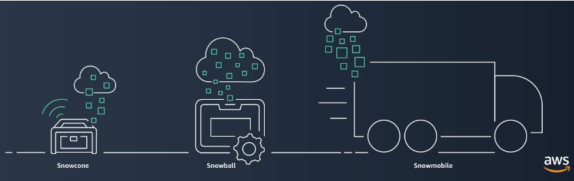

# Migration and Innovation in the AWS Cloud

# [AWS Cloud Adoption Framework](#aws-cloud-adoption-framework)

**The [AWS Cloud Adoption Framework (AWS CAF)](https://d1.awsstatic.com/whitepapers/aws_cloud_adoption_framework.pdf) organizes guidance into six areas of focus, called Perspectives.** 

Focus on Business:
- Business
- People
- Governance

Focus on Technical Capabilities:
- Platform
- Security
- Operations

---

### [Business Perspective](#business-perspective)

The Business Perspective ensures that IT aligns with business needs and that IT investments link to key business results.

### [People Perspective](#people-perspective)

The People Perspective supports development of an organization-wide change management strategy for successful cloud adoption.

### [Governance Perspective](#governance-perspective)

The Governance Perspective focuses on the skills and processes to align IT strategy with business strategy. This ensures that you maximize the business value and minimize risks.

### [Platform Perspective](#platform-perspective)

The Platform Perspective includes principles and patterns for implementing new solutions on the cloud, and migrating on-premises workloads to the cloud.

### [Security Perspective](#security-perspective)

The Security Perspective ensures that the organization meets security objectives for visibility, auditability, control, and agility.

### [Operations Perspective](#operations-perspective)

The Operations Perspective helps you to enable, run, use, operate, and recover IT workloads to the level agreed upon with your business stakeholders.

---

## [AWS CAF Use Cases](#aws-caf-use-cases)

- Use the Business Perspective to create a strong business case for cloud adoption and prioritize cloud adoption initiatives.

- Use the People Perspective to evaluate organizational structures and roles, new skill and process requirements, and identify gaps. 

- Use the Governance Perspective to understand how to update the staff skills and processes necessary to ensure business governance in the cloud. 

- Use the Platform Perspective  to understand and communicate the structure of IT systems and their relationships and describe the architecture of the target state environment in detail.

- Use the Security Perspective to structure the selection and implementation of security controls that meet the organization’s needs.

- Use the Operations Perspective to define how day-to-day, quarter-to-quarter, and year-to-year business is conducted. 

---

# [Migration Strategies](#migration-strategies)

When migrating applications to the cloud, six of the most common [migration strategies](https://aws.amazon.com/blogs/enterprise-strategy/6-strategies-for-migrating-applications-to-the-cloud/) that you can implement are:

### [Rehosting](#rehosting)

**Rehosting also known as “lift-and-shift” involves moving applications without changes.** 

### [Replatforming](#replatforming)

**Replatforming, also known as “lift, tinker, and shift,” involves making a few cloud optimizations to realize a tangible benefit.** Optimization is achieved without changing the core architecture of the application.

### [Refactoring/re-architecting](#refactoringre-architecting)

**Refactoring (also known as re-architecting) involves reimagining how an application is architected and developed by using cloud-native features.** Now, you're writing new code.

### [Repurchasing](#repurchasing)

**Repurchasing involves moving from a traditional license to a software-as-a-service model.** This is common for companies looking to abandon legacy software vendors. Repurchasing involves replacing an existing application with a cloud-based version

### [Retaining](#retaining)

**Retaining consists of keeping applications that are critical for the business in the source environment.** This might include applications that require major refactoring before they can be migrated, or, work that can be postponed until a later time.

### [Retiring](#retiring)

**Retiring is the process of removing applications that are no longer needed.**

---

# [AWS Snow Family](#aws-snow-family)

**The [AWS Snow Family](https://aws.amazon.com/snow) is a collection of physical devices that help to physically transport up to exabytes of data into and out of AWS.** 

AWS Snow Family is composed of:
- AWS Snowcone, 
- AWS Snowball, and 
- AWS Snowmobile. 

---

## [AWS Snowcone](#aws-snowcone)

**[AWS Snowcone](https://aws.amazon.com/snowcone) is a small, rugged, and secure edge computing and data transfer device.** 

It features 2 CPUs, 4 GB of memory, and 8 TB of usable storage.

---

## [AWS Snowball](#aws-snowball)

**[AWS Snowball](https://aws.amazon.com/snowball/)** offers two types of devices:

1. **Snowball Edge Storage Optimized** devices are well suited for large-scale data migrations and recurring transfer workflows.

2. **Snowball Edge Compute Optimized** provides powerful computing resources for use cases such as machine learning, full motion video analysis, analytics, and local computing stacks. 

| Device | Storage | Compute |
| ------ | -------- | ------- |
|Snowball Edge Storage Optimized| 80 TB HDD | 40 vCPUs, 80 GiB of memory |
|Snowball Edge Compute Optimized| 42 TB HDD | 52 vCPUs, 208 GiB of memory |

---

## [AWS Snowmobile](#aws-snowmobile)

**[AWS Snowmobile](https://aws.amazon.com/snowmobile) is an exabyte-scale data transfer service used to move large amounts of data to AWS.** 

You can transfer up to **100 petabytes of data per Snowmobile**.

---

## [AWS Snow Family Use Cases](#aws-snow-family-use-cases)

* **AWS Snowcone** - Customers usually use these devices to ship terabytes of information such as analytics data, video libraries, image collections, backups, and even tape replacement data.

* **AWS Snowball** - The use cases include capturing of streams from IoT devices, image compression, video transcoding, and even industrial signaling. 

* **AWS Snowmobile** - It's ideal for the largest migrations and even data center shutdowns. 

---

# [Innovation with AWS](#innovation-with-aws)

---

# [Notes](#notes)

- Common roles in the Business Perspective include: Business managers, Finance managers, Budget owners, Strategy stakeholders.
- Common roles in the People Perspective include: Human resources, Staffing, People managers.
- Common roles in the Governance Perspective include: Chief Information Officer (CIO), Program managers, Enterprise architects, Business analysts, Portfolio managers.
- Common roles in the Platform Perspective include: Chief Technology Officer (CTO), IT managers, Solutions architects.
- Common roles in the Security Perspective include: Chief Information Security Officer (CISO), IT security managers, IT security analysts.
- Common roles in the Operations Perspective include: IT operations managers, IT support managers.
- Edge computing options are Amazon EC2 instances and AWS IoT Greengrass.

---

# References
- [An Overview of the AWS Cloud Adoption Framework](https://d1.awsstatic.com/whitepapers/aws_cloud_adoption_framework.pdf) *whitepaper*
- [6 Strategies for Migrating Applications to the Cloud](https://aws.amazon.com/blogs/enterprise-strategy/6-strategies-for-migrating-applications-to-the-cloud/)