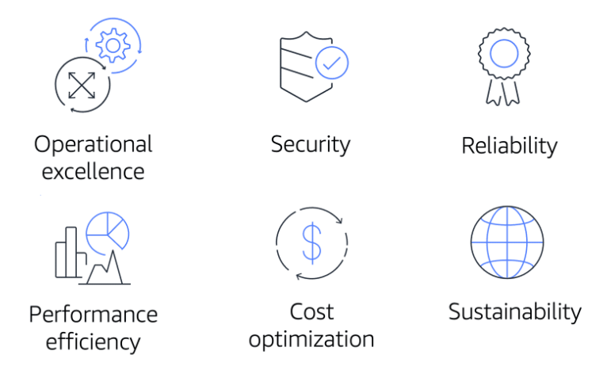

# AWS Well-Architected Framework & Benefits of Cloud Computing

# [AWS Well-Architected Framework](#aws-well-architected-framework)

**The [AWS Well-Architected Framework](https://d1.awsstatic.com/whitepapers/architecture/AWS_Well-Architected_Framework.pdf) helps you understand how to design and operate reliable, secure, efficient, and cost-effective systems in the AWS Cloud.** 

It provides a way for you to consistently measure your architecture against best practices and design principles and identify areas for improvement.

The Well-Architected Framework is based on six pillars: 

---

## [Operational Excellence](#operational-excellence)

**Operational excellence** is the ability to run and monitor systems to deliver business value and to continually improve supporting processes and procedures.  

Design principles for operational excellence in the cloud include performing operations as code, annotating documentation, anticipating failure, and frequently making small, reversible changes.

## [Security](#security)

**The Security pillar** is the ability to protect information, systems, and assets while delivering business value through risk assessments and mitigation strategies. 

When considering the security of your architecture, apply these best practices: automate security best practices when possible, apply security at all layers, protect data in transit and at rest.

## [Reliability](#reliability)

**Reliability** is the ability of a system to do the following:
- Recover from infrastructure or service disruptions
- Dynamically acquire computing resources to meet demand
- Mitigate disruptions such as misconfigurations or transient network issues.

Reliability includes testing recovery procedures, scaling horizontally to increase aggregate system availability, and automatically recovering from failure.

## [Performance Efficiency](#performance-efficiency)

**Performance efficiency** is the ability to use computing resources efficiently to meet system requirements and to maintain that efficiency as demand changes and technologies evolve. 

Evaluating the performance efficiency of your architecture includes experimenting more often, using serverless architectures, and designing systems to be able to go global in minutes.

## [Cost Optimization](#cost-optimization)

**Cost optimization** is the ability to run systems to deliver business value at the lowest price point. 

Cost optimization includes adopting a consumption model, analyzing and attributing expenditure, and using managed services to reduce the cost of ownership.

## [Sustainability](#sustainability)

**Sustainability** is the ability to continually improve sustainability impacts by reducing energy consumption and increasing efficiency across all components of a workload by maximizing the benefits from the provisioned resources and minimizing the total resources required.

---

# [Benefits of the AWS Cloud](#benefits-of-the-aws-cloud)

### Trade upfront expense for variable expense

Upfront expenses include data centers, physical servers, and other resources that you would need to invest in before using computing resources. 

Instead of investing heavily in data centers and servers before you know how you’re going to use them, you can pay only when you consume computing resources.

### Benefit from massive economies of scale

By using cloud computing, you can achieve a lower variable cost than you can get on your own because usage from hundreds of thousands of customers aggregates in the cloud.

### Stop guessing capacity

With cloud computing, you don’t have to predict how much infrastructure capacity you will need before deploying an application. 

### Increase speed and agility

The flexibility of cloud computing makes it easier for you to develop and deploy applications.

### Stop spending money running and maintaining data centers

Cloud computing in data centers often requires you to spend more money and time managing infrastructure and servers. 

### Go global in minutes.

The AWS Cloud global footprint enables you to quickly deploy applications to customers around the world, while providing them with low latency.

---

# [Notes](#notes)

- In December 2021, AWS introduced a sustainability pillar as part of the AWS Well-Architected Framework.
- The Cost Optimization pillar focuses on the ability to run systems to deliver business value at the lowest price point.
- The Performance Efficiency pillar focuses on using computing resources efficiently to meet system requirements and to maintain that efficiency as demand changes and technologies evolve.
- The Reliability pillar focuses on the ability of a workload to consistently and correctly perform its intended functions.
- Operational Excellence includes the ability to run workloads effectively and gain insights into their operations.
- 

---

# References

- [AWS Well-Architected](https://aws.amazon.com/architecture/well-architected/)
- [AWS Well-Architected Framework](https://docs.aws.amazon.com/wellarchitected/latest/framework/welcome.html)
- [AWS Architecture Center](https://aws.amazon.com/architecture)
- [Six Advantages of Cloud Computing](https://docs.aws.amazon.com/whitepapers/latest/aws-overview/six-advantages-of-cloud-computing.html)
- [AWS Architecture Blog](https://aws.amazon.com/blogs/architecture)